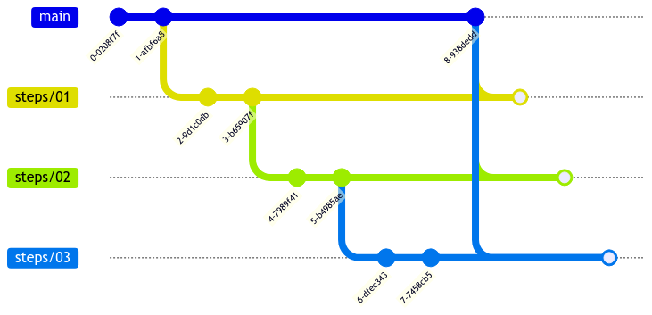

# tdd-refactor

This repo contains the step-by-step procedure on how to refactor really bad code using TDD for a characterization testing-like approach.

Though this examples should be used from «students» itself, they are tailor-made to an agile technical mentoring approach.

## About this repo

The repo is made using C# language on dotnet 6+.

The `main` branch intentionally contains a **dirty code**, that is not respecting any of the SOLID principles.

The `steps/*` branches contains the refactored code, each step has the explanation and an example of a SOLID principle.

Steps are subsequent: step 2 starts from step 1 and so on.

### Example

* `steps/01_SRP` contains the code refactored to fulfill the Single Responsibility Principle
* `steps/02_OCP` contains the `steps/01` code, but with the Open-Closed Principle implemented
* ...
* last step contains the fully refactored code, respecting all SOLID principles

### Remarks

As the `steps` are sequential, an edit to the previous branch should be merged to the next step:

